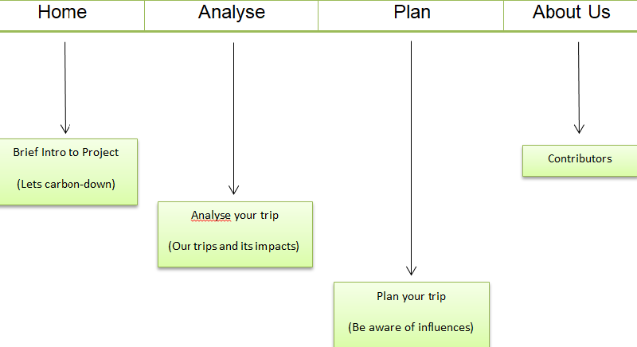
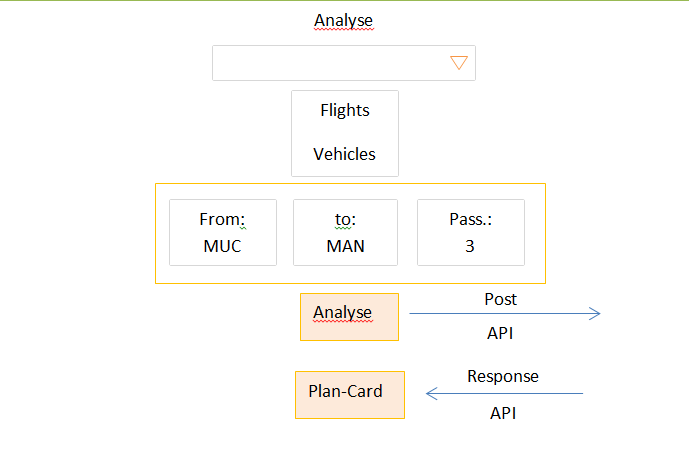
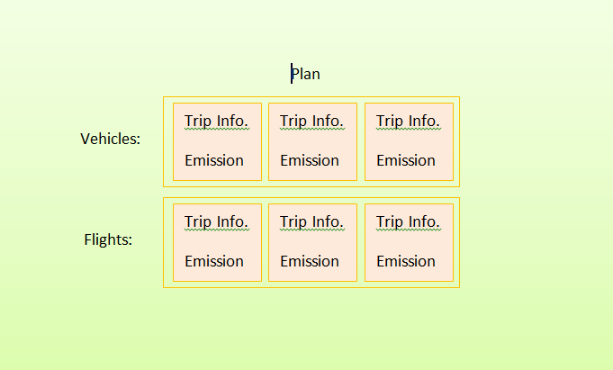
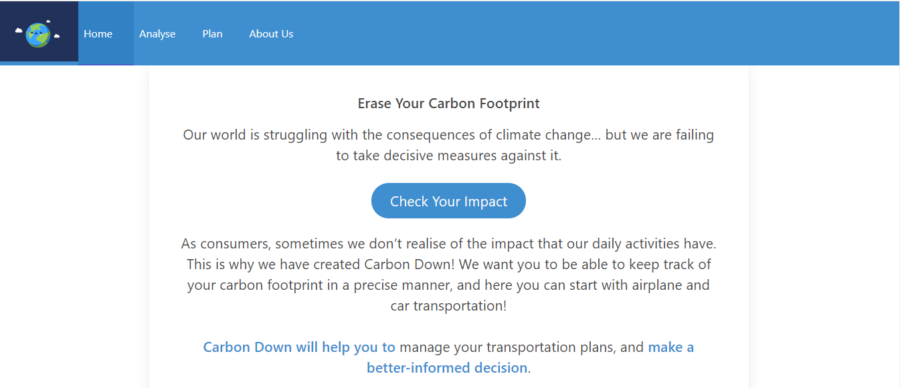
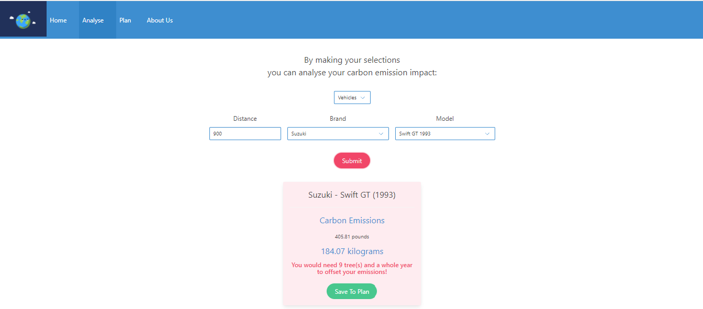
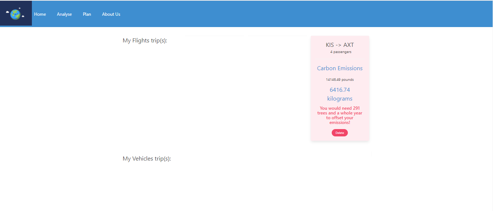
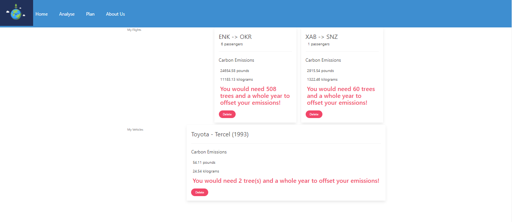
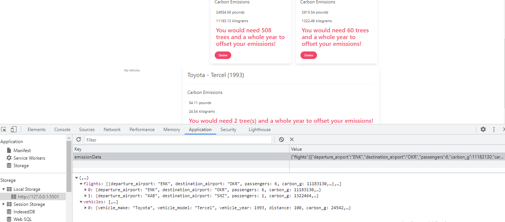
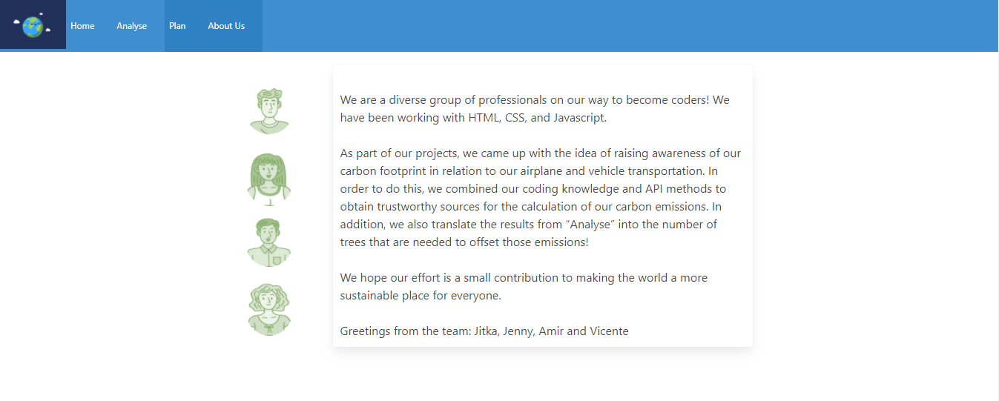

<div style="text-align:center"><a href="https://jitasek.github.io/carbon-down/"></a></div>

<h1>Carbon-Down</h1>

<h2>Table of Content</h2>

- [Project Link](#project-link)
- [Getting Started](#getting-started)
- [Contributors](#contributors)
- [About The project](#about-the-project)

  - [User Flow](#user-flows)
  - [Technologies Used](#technologies-used)
  - [Web APIs](#web-apis)
  - [Wireframes](#wireframes)

- [Plans For Improvement](#plansforimprovement)
- [Screenshots](#Screenshots)

  - [Index page](#index-page)
  - [Analyse page Flights](#analyse-page-flights)
  - [Analyse page Vehicles](#analyse-page-vehicles)
  - [Plan page](#plan-page)
  - [Plan with recent search](#plan-with-recent-search)
  - [Local Storage](#local-storage)

### Project Link

- Please click [here](https://github.com/jitasek/carbon-down) to see the contents of our project in Github
- [here](https://jitasek.github.io/carbon-down/) you can access directly the web page
- Please click [here](https://docs.google.com/presentation/d/1TYoXgIxT0TbWKb5QAIZFguArPE2ShADOfkmo18jEbus/edit#slide=id.gfd4231a3f5_0_3) to see the presentation of the project

### Getting Started

- Clone the GitHub project into your local machine
- Navigate into the project
- Open the project into VSCode
- Open the 'index.html' 3M & open with live server(Alt+L Alt+O)

```
git clone git@github.com:jitasek/carbon-down.git
cd carbon-down
code .
```

### Contributors

- Jenny : https://github.com/JenBerlin
- Jitka : https://github.com/jitasek
- Vicente : https://github.com/vvicunag
- Amir : https://github.com/Amir-Fard2025
- Swapnil : https://github.com/swapbcs

### About The Project

<p>Carbon Down app brings a real-world-problem to user's attention: 
the common responsible goal to track/reduce carbon emissions. 
It throws light on the carbon impact of their travels with the aim to raise awareness of this important topic and help them navigate towards a more environmentally responsible life.</p>

#### User Flow

<p>As a traveller, I want to analyse my already planned travel trips by flight and/or car, so that I can get an idea about the carbon emission caused by the trip.
To keep all my analysed data in one place , I’m able to save and display them on a page.</p>

#### Technologies Used

<p>The following technologies are implemented in this project:</p>

- HTML
- CSS
- Bulma, Modern CSS
- JavaScript
- jQuery
- Localstorage
- Font Awesome

#### Web APIs

- The following APIs are implemented in this project:
- [Carbon Interface](https://www.carboninterface.com)
- [Iata](https://www.iata.org/en/services/statistics),here we used the API to save the airports' information and later we use it as an object locally

#### Wireframes

> Note:
> The structure of the code has been built According to the main flowcharts; however there could be some slight changes during the developing process





#### Plans For Improvement

<p>Including other common CO2 emitting activities (e.g. shipping)
Suggesting alternative (transport) options
Building User Community 
Collaborating with other platforms, such as ...
Providing it in multiple languages</p>

#### Screenshots

- Index page 

- Analyse page Flights 

- Analyse page Vehicles 

- Plan page 

- Plan with recent search 

- Local Storage 

- About Us 
